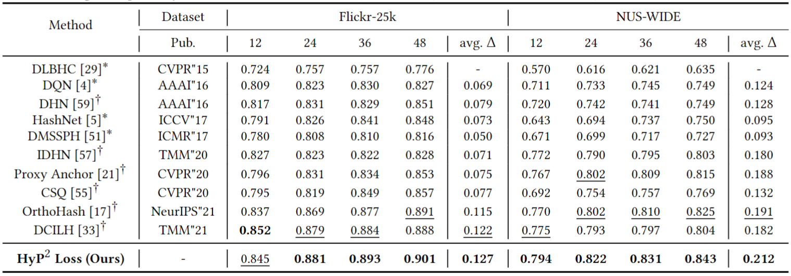
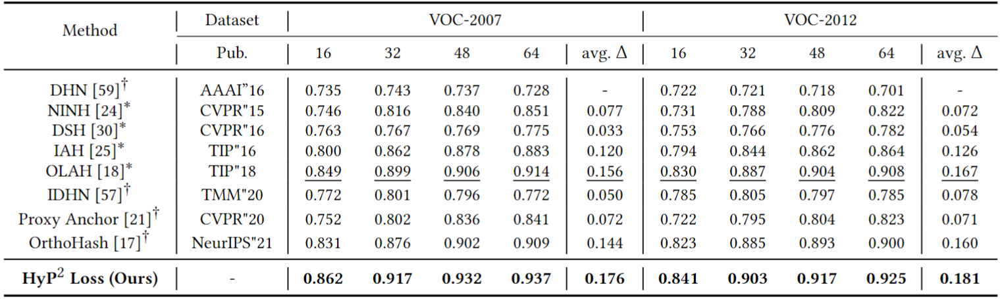
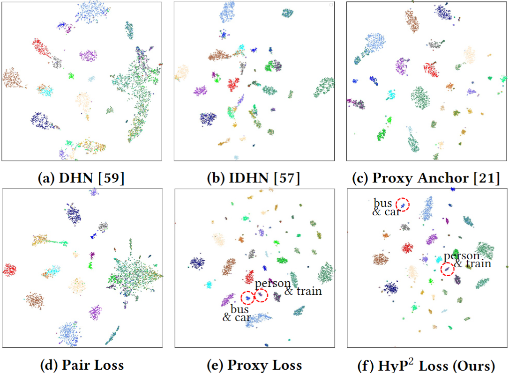
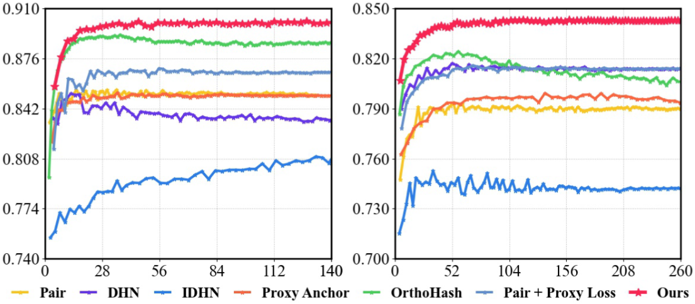
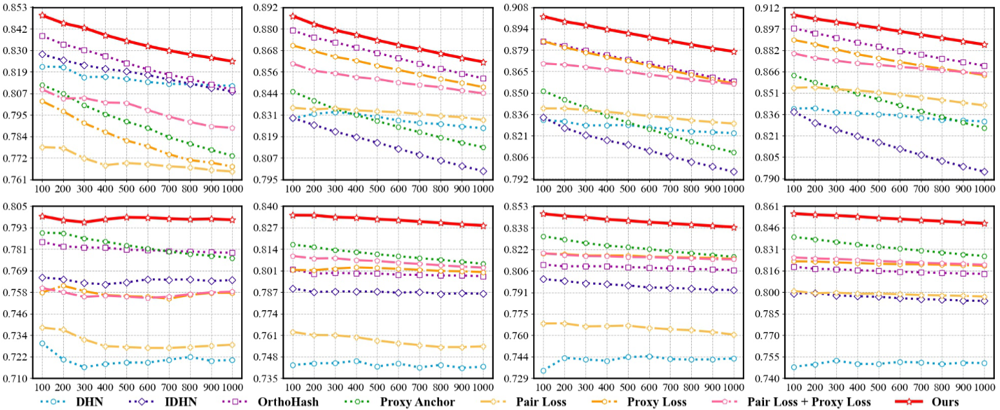

# HyP<sup>2</sup>-Loss
Official PyTorch implementation of paper HyP<sup>2</sup> Loss : Beyond Hypersphere Metric Space for Multi-label Image Retrieval
### Presentation Video
Please click [Presentation Video](https://youtu.be/qiZ9r2ox15k)
### Requirements
```
NVIDIA GPU + CUDA (may CuDNN) and corresponding PyTorch framework
Python 3
numpy
xlrd
```
### Datasets
##### Flickr-25K/NUS-WIDE
Please download the data from the official websites([FLickr](https://press.liacs.nl/mirflickr/), [NUS-WIDE](https://lms.comp.nus.edu.sg/wp-content/uploads/2019/research/nuswide/NUS-WIDE.html)) and put the images into folder `./data/flickr25k/mirflickr/`, `./data/nus_wide/images/` respectively.
##### VOC2007/VOC2012
Please run the training command with `--dataset voc2007/voc2012` directly and the voc2007/voc2012 dataset will be downloaded automatically.
### Training
```
python retrieval.py --dataset [dataset] --backbone [backbone] --hash_bit [hash_bit]
```
Arguments (default value)
```
--dataset:        dataset                                         [(voc2007), voc2012, flickr, nuswide]
--backbone:       backbone network for feature extracting         [(googlenet), alexnet, resnet]
--hash_bit:       length of hash bits                             [(48), 12, 16, 24, 32, 36, 64]
```
Other optional arguments
```
--beta:           a hyper-parameter to balance the contribution of proxy loss and pair loss      
--batch_size      the size of a mini-batch                                                            
```
### Inference
Add `--test` after the training command. Make sure there is a corresponding `.ckpt` file in the `./result/` directory.
```
python retrieval.py --dataset [dataset] --backbone [backbone] --hash_bit [hash_bit] --test
```
### Performance
<sup>*</sup>: reported results with the same experiment settings. 

<sup>†</sup>: our reproduced results through the publicly available models. 

Bold font (underlined) values indicate the best (second best).

mAP performance by Hamming Ranking for different hash bits (𝑲 ∈ {12, 24, 36, 48}) in Flickr-25k (mAP@1, 000) and
NUS-WIDE (mAP@5, 000) with AlexNet. 

<div align=center></div>

mAP performance by Hamming Ranking for different hash bits (𝑲 ∈ {16, 32, 48, 64}) in VOC-2007 (mAP@5, 011) and
VOC-2012 (mAP@5, 717) with GoogLeNet. 

<div align=center></div>

Visualized t-SNE comparisons in VOC-2007 dataset with 48 hash bits. The scatters of the same color indicate the
same categories. The red circles indicate irrelevant samples.

<div align=center></div>

Convergence comparisons in Flickr-25k (left) and NUS-WIDE (right) (48 hash bits with AlexNet). x-axis: training time (sec.), y-axis: mAP@1, 000 (left) and 5, 000 (right) performance on the query dataset. HyP<sup>2</sup> Loss achieves a faster
convergence speed with a more stable training process.

<div align=center></div>

Performance of different methods in Flickr-25k(top) and NUS-WIDE(bottom) datasets. From left to right: Top-𝑵 curves
(x-axis (Top-𝑵 ): 100 → 1, 000, y-axis (Precision): 0 → 1) w.r.t. 12, 24, 36, 48 hash bits, respectively. Our HyP<sup>2</sup> Loss outperforms previous methods in different datasets among various hash bit lengths consistently.

<div align=center></div>

### Citation
If you use this method or this code in your research, please cite as:
```
@inproceedings{HyP2loss,
  title={HyP $\^{} 2$ Loss: Beyond Hypersphere Metric Space for Multi-label Image Retrieval},
  author={Xu, Chengyin and Chai, Zenghao and Xu, Zhengzhuo and Yuan, Chun and Fan, Yanbo and Wang, Jue},
  booktitle = {{MM} '22: {ACM} Multimedia Conference},
  year      = {2022}
}
```
